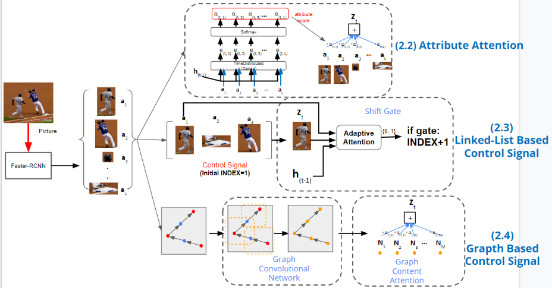
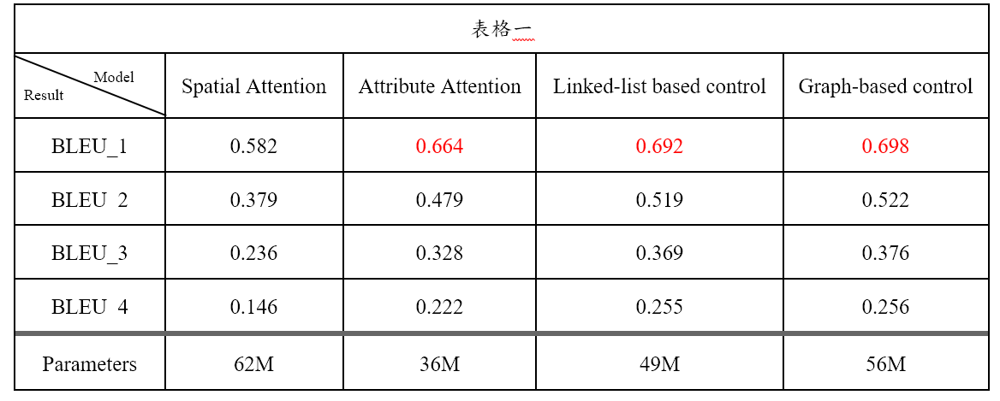
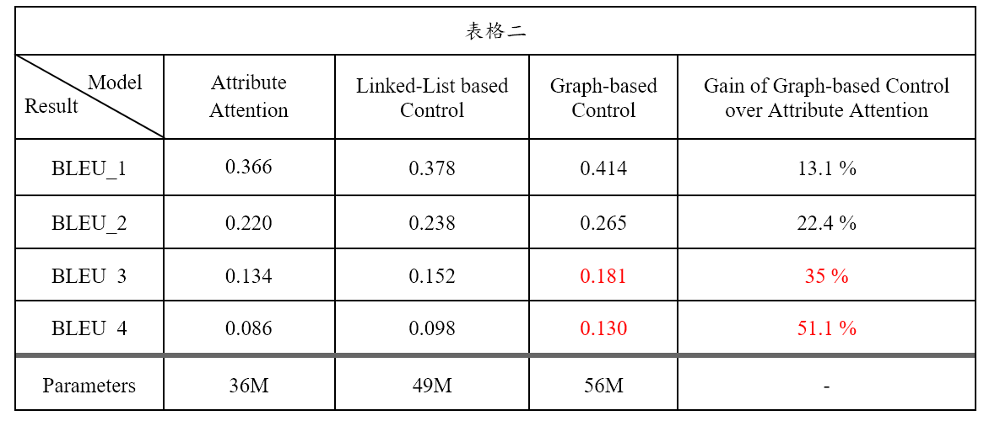

# Image-Caption
這是我大學的專題實作，如果有哪些地方沒有註明來源出處的，且務必寄信通知我，我會立即補上

## Introduction

### Spatial Attention
參考於課本 [OREILLY hands-on machine learning](https://www.oreilly.com/library/view/hands-on-machine-learning/9781492032632/)，請參照例圖一的上方，使用兩層的 LSTM 和 Attention 的機制。一開始先進入 Encoder (ResNet50) ，產生 feature maps 後進入 MLP 維度轉換，其輸出會走兩個路線，一是進入第一層的 LSTM，二是進入 Spatial Attention ，產生z_t後與第一層的 LSTM 的輸入一起 concatenate 成一個成為第二個 LSTM 的輸入，其輸出再進入 Softmax 來預測這一個字，這樣的BLEU_1 為 0.582 (表格二)。

### Attribute Attention
參考了 [Anderson et al.(CVPR, 2018)](http://example.comhttps://openaccess.thecvf.com/content_cvpr_2018/CameraReady/1163.pdf)，其Encoder和 Decoder 與 § 2.1 相同。 請參照例圖二 (2.2)，我們不使用 image 上每一個 pixels 為Attention Layer的輸入，而是利用 Faster R-CNN 擷取照片中的物件，其輸出在接回 Decoder(圖一)，這樣的BLEU_1 為 0.664(表格二)，比前一個技術成長了14%。 


### Linked-List Based Control Signal
參考了 [Cornia et al.(CVPR, 2019)](https://openaccess.thecvf.com/content_CVPR_2019/papers/Cornia_Show_Control_and_Tell_A_Framework_for_Generating_Controllable_and_CVPR_2019_paper.pdf) 加入 control signal的概念，把這些物件進行排序，成為每一次 Decoder 的輸入z_t，其 Shift Gate (圖二)利用Adaptive Attention來生成機率來判斷是否要改變control signal，如果機率大於0.5就換到下一個物件，小於0.5則繼續使用相同的物件。這樣的BLEU_1 為 0.692(表格二)，比前一個技術成長了5%。


### Graph Based Control Signal **(此由同組隊員實作)**
參考 Zheng et al.(CVPR, 2019) ，其 control signal 為 Graph (圖二)的形式，並利用 GCN 的技術讓各個 node了解其鄰居的資訊，再把這些 node 輸入到 Graph Content Attention，來產生每個 node 的權重，在座做weighted sum求出z_t ，成為Decoder 的輸入。這樣 Controllability 的能力比前一個技術成長了51.1%(表格三)。


圖一 為Encoder 和 Decoder 之間的設計



圖二 § 2.2、§ 2.3、§ 2.4 的技術介紹



圖一 為Encoder 和 Decoder 之間的設計



圖二 § 2.2、§ 2.3、§ 2.4 的技術介紹


```
Repository
|
│   README.md # Base Readme.
│   
└───Attribute-Attention
│    |   Evaluate.ipynb        # 用來測試 BLEU 的數值
|    |   make_test.ipynb       # 製作 test dataset
|    |   make_train_val.ipynb  # 製作 train 和 validation dataset
|    |   Model.ipynb           # 主要的模型
|    |
└───Evaluate_tool
|    │   all.ipynb             # 以下所有功能都有
|    |   faster_rcnn.ipynb     # 執行 Faster R-CNN
|    |   make_image_url.ipynb  # 利用 url 來找原始照片
|    |   search_label.ipynb    # 要用 id 來找照片的 caption
|
└──  Linked-List-Based-Control-Signal
|    |   Evaluate.ipynb        # 用來測試 BLEU 的數值
|    |   make_train_val.ipynb  # 製作 train 和 validation dataset
|    |   Model.ipynb           # 主要的模型
|    |   Model_test.ipynb      # 預測 test dataset
|   
└───Dataset                    # 要訓練資料集的位子
|    │
│   
└───Results                    # 預測出來的 caption 的儲存位子
|    │  
|
└───Model_Backup               # 模型備份的位子
|    │ 
│ 
└───contain each run.


```